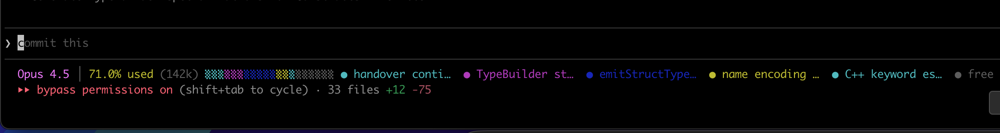
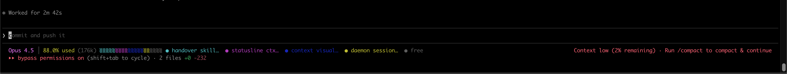
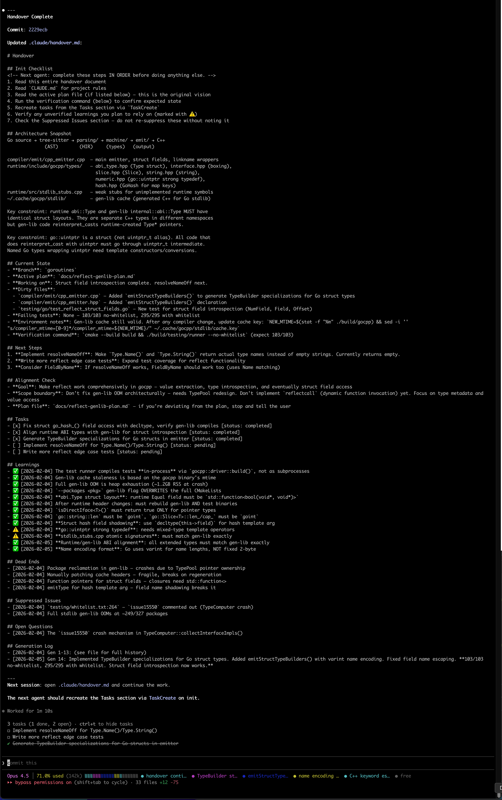

# Handover

A Claude Code plugin for preserving context, learnings, and state across agent sessions. When you're running low on context (~80% used), invoke `/handover` to create a living document that the next agent can pick up seamlessly. 

This is specifically designed for long-running, big and complex tasks; to keep Claude on track. Tasks where a single session is not enough and auto-compact doesn't cut it.

This works for me much better than auto-compact. This helps also a messing-up agent to stop, reflect, and restart with learnings in a fresh context. In this case I just tell the agent "You messed up, we need to handover"; works great! 

Note: This is not designed to make agents run forever autonomously; Quite the opposite: You are still in the driver seat. From my experience going full auto-pilot is a bad idea and never worked, hence why I designed this plugin and workflow instead.

## Features

- **Living handover document** (`.claude/handover.md`) that accumulates learnings across generations
- **Context-aware statusline** showing usage percentage and topic segmentation
- **Suppressed issue tracking** — catches when agents hide problems instead of fixing them
- **Task preservation** — captures in-flight tasks before session ends
- **WIP commits** — automatically commits current state so next agent can't accidentally revert
- **Takeover skill** — for when you forgot to handover and need to recover from a closed session


Nice status line to know when you have context-rot and should handover:



## Workflow

```
                              THE HANDOVER CYCLE
                              ==================

    ┌──────────────────────────────────────────────────────────────────────┐
    │                                                                      │
    │    SESSION N                              SESSION N+1                │
    │    ─────────                              ───────────                │
    │                                                                      │
    │    Agent works                            Agent reads                │
    │         │                                 .claude/handover.md        │
    │         │                                      │                     │
    │         ▼                                      ▼                     │
    │    ┌─────────┐                           ┌─────────┐                 │
    │    │ context │                           │ init    │                 │
    │    │ fills   │                           │checklist│                 │
    │    │ up...   │                           └────┬────┘                 │
    │    └────┬────┘                                │                      │
    │         │                                     ▼                      │
    │         │ ~80% used?                     continues work              │
    │         │                                with full context           │
    │         ▼                                     │                      │
    │    ┌─────────┐                                │                      │
    │    │/handover│                                │                      │
    │    └────┬────┘                                │                      │
    │         │                                     │                      │
    │         ├── gather context                    │                      │
    │         ├── extract learnings                 │                      │
    │         ├── capture tasks                     │                      │
    │         ├── scan suppressed issues            │                      │
    │         ├── curate existing knowledge         │                      │
    │         └── WIP commit                        │                      │
    │              │                                │                      │
    │              ▼                                │                      │
    │    ┌──────────────────┐                       │                      │
    │    │.claude/handover.md                       │                      │
    │    │                  │◄──────────────────────┘                      │
    │    │ • architecture   │                                              │
    │    │ • current state  │      (living document that                   │
    │    │ • learnings ⚠️✅  │       accumulates across                     │
    │    │ • dead ends      │       agent generations)                     │
    │    │ • suppressed     │                                              │
    │    │ • tasks          │                                              │
    │    └──────────────────┘                                              │
    │                                                                      │
    └──────────────────────────────────────────────────────────────────────┘

                    Knowledge compounds, not resets.
```

### Detailed Flow

```
┌─────────────────────────────────────────────────────────────────────────────┐
│                            SESSION 1 (Agent A)                              │
│                                                                             │
│   Work, work, work...                                                       │
│                                                                             │
│   ┌─────────────────────────────────────────────────────────────────────┐   │
│   │ Opus 4.5 │ 82% used (164k) ▒▒▒▒▒▒▒▒▒▒▒▒▒▒▒▒░░░░ ● task A  ● free   │   │
│   └─────────────────────────────────────────────────────────────────────┘   │
│                                                                             │
│   User: "Let's handover"                                                    │
│                                    │                                        │
│                                    ▼                                        │
│                         ┌───────────────────┐                               │
│                         │    /handover      │                               │
│                         │                   │                               │
│                         │ • Gather context  │                               │
│                         │ • Extract learns  │                               │
│                         │ • Capture tasks   │                               │
│                         │ • Scan issues     │                               │
│                         │ • WIP commit      │                               │
│                         └─────────┬─────────┘                               │
│                                   │                                         │
│                                   ▼                                         │
│                         ┌───────────────────┐                               │
│                         │ .claude/handover.md                               │
│                         │                   │                               │
│                         │ • Init checklist  │                               │
│                         │ • Architecture    │                               │
│                         │ • Current state   │                               │
│                         │ • Next steps      │                               │
│                         │ • Tasks           │                               │
│                         │ • Learnings ⚠️✅   │                               │
│                         │ • Dead ends       │                               │
│                         │ • Suppressed      │                               │
│                         │ • Generation log  │                               │
│                         └─────────┬─────────┘                               │
└───────────────────────────────────┼─────────────────────────────────────────┘
                                    │
                                    │  (session ends)
                                    │
┌───────────────────────────────────┼─────────────────────────────────────────┐
│                            SESSION 2 (Agent B)                              │
│                                    │                                        │
│   User: "Read .claude/handover.md and continue"                             │
│                                    │                                        │
│                                    ▼                                        │
│                         ┌───────────────────┐                               │
│                         │   Init Checklist  │                               │
│                         │                   │                               │
│                         │ 1. Read handover  │                               │
│                         │ 2. Read CLAUDE.md │                               │
│                         │ 3. Read plan file │                               │
│                         │ 4. Run verify cmd │                               │
│                         │ 5. Recreate tasks │                               │
│                         │ 6. Verify learns  │                               │
│                         │ 7. Check issues   │                               │
│                         └─────────┬─────────┘                               │
│                                   │                                         │
│                                   ▼                                         │
│                                                                             │
│   Agent B continues with full context, learnings, and task list...          │
│                                                                             │
│   ┌─────────────────────────────────────────────────────────────────────┐   │
│   │ Opus 4.5 │ 15% used (30k) ▒▒▒░░░░░░░░░░░░░░░░░ ● setup  ● free      │   │
│   └─────────────────────────────────────────────────────────────────────┘   │
│                                                                             │
└─────────────────────────────────────────────────────────────────────────────┘
```

## Screenshots

### Statusline with context segmentation





### Handover document



## Installation

### 1. Copy the skill to your project

```bash
# In your project directory
mkdir -p .claude/skills/handover
curl -o .claude/skills/handover/SKILL.md https://raw.githubusercontent.com/marcj/handover/main/skills/handover/SKILL.md

# Optional: takeover skill for recovering from forgotten handovers
mkdir -p .claude/skills/takeover
curl -o .claude/skills/takeover/SKILL.md https://raw.githubusercontent.com/marcj/handover/main/skills/takeover/SKILL.md
```

Or for global installation (all projects):

```bash
mkdir -p ~/.claude/skills/handover ~/.claude/skills/takeover
curl -o ~/.claude/skills/handover/SKILL.md https://raw.githubusercontent.com/marcj/handover/main/skills/handover/SKILL.md
curl -o ~/.claude/skills/takeover/SKILL.md https://raw.githubusercontent.com/marcj/handover/main/skills/takeover/SKILL.md
```

### 2. Install the statusline (optional but recommended)

The statusline shows context usage and topic segmentation at a glance.

```bash
# Create statusline directory
mkdir -p ~/.claude/statusline

# Download the scripts
curl -o ~/.claude/statusline/ctx_monitor.js https://raw.githubusercontent.com/marcj/handover/main/statusline/ctx_monitor.js
curl -o ~/.claude/statusline/ctx_daemon.js https://raw.githubusercontent.com/marcj/handover/main/statusline/ctx_daemon.js

# Make executable
chmod +x ~/.claude/statusline/ctx_monitor.js ~/.claude/statusline/ctx_daemon.js

# Add to Claude Code settings
cat ~/.claude/settings.json | jq '. + {"statusLine": {"type": "command", "command": "~/.claude/statusline/ctx_monitor.js"}}' > /tmp/settings.json && mv /tmp/settings.json ~/.claude/settings.json
```

Or manually add to `~/.claude/settings.json`:

```json
{
  "statusLine": {
    "type": "command",
    "command": "~/.claude/statusline/ctx_monitor.js"
  }
}
```

## Usage

### Handover (end of session)

When you're running low on context or ending a work session:

```
/handover
```

Or naturally mention it:
- "We need to handover"
- "Let's handover to the next agent"
- "You keep making the same mistake, we need to handover to a fresh agent"

The agent will:
1. Gather context from the conversation
2. Scan for suppressed issues (tests skipped, code commented out, etc.)
3. Capture active tasks
4. Propose learnings extracted from the session
5. Curate existing knowledge (verify what's still relevant)
6. Write/update `.claude/handover.md`
7. Create a WIP commit

### Takeover (new session, forgot to handover)

If you closed a session without running `/handover`:

```
/takeover
```

This will:
1. Find recent session transcripts
2. Let you pick which session to recover
3. Run the handover protocol on that closed session
4. Create the handover document retroactively

### Starting a new session

The next agent should begin with:

```
Read .claude/handover.md and continue the work
```

The handover document includes an init checklist the agent must follow.

## Handover Document Structure

`.claude/handover.md` contains:

- **Init Checklist** — steps the next agent must complete before starting
- **Architecture Snapshot** — high-level project structure (evolves slowly)
- **Current State** — branch, dirty files, failing tests, verification command
- **Next Steps** — prioritized task list
- **Alignment Check** — goal, scope boundary, plan file reference
- **Tasks** — captured from Claude's task list
- **Learnings** — accumulated knowledge (⚠️ unverified, ✅ verified)
- **Dead Ends** — approaches that didn't work
- **Suppressed Issues** — problems hidden instead of fixed
- **Open Questions** — unresolved technical decisions
- **Generation Log** — audit trail of all handovers

## Statusline

The statusline shows:

```
Opus 4.5 │ 82.0% used (164k) ▒▒▒▒▒▒▒▒▒▒▒▒▒▒▒▒░░░░ ● handover skill  ● statusline  ● free
```

- Model name
- Context usage percentage and token count
- Visual bar with topic segments
- Legend showing what each segment represents

The segmentation is powered by a background daemon that calls **Claude Haiku** (the cheapest/fastest model) via `claude --print` to analyze the conversation topics. It only re-analyzes when context increases by 10%+ and at least 60 seconds have passed, keeping costs minimal.

## How It Works

### Knowledge Preservation

The handover document is a **living document** — it's not just a snapshot, it accumulates knowledge across agent generations:

- **Learnings** are appended with each handover, marked as unverified (⚠️)
- Later agents can verify learnings against the codebase and mark them ✅
- Stale entries are pruned when the agent confirms they no longer apply

### Suppressed Issue Detection

Agents sometimes "solve" problems by hiding them:
- Removing tests from whitelists
- Adding `.skip` to failing tests
- Commenting out problematic code
- Adding workarounds with "doesn't support yet" comments

The handover skill scans for these patterns and tracks them in the **Suppressed Issues** section. These can only be removed when the underlying issue is actually fixed.

### No Interruptions

The handover process is designed to be fast and non-intrusive:
- Agent extracts information from conversation context (no re-reading files)
- Agent proposes learnings instead of asking you to recall
- Agent curates existing entries by checking the codebase, not asking you
- Only asks for human judgment where needed (direction, scope)

## Configuration

### Segmentation Thresholds

In `ctx_daemon.js`:

```javascript
const MIN_INTERVAL_MS = 60 * 1000;  // 60 seconds between analyses
const MIN_PCT_DELTA = 10;           // 10% context increase before re-analyze
```

### Daemon Idle Timeout

The daemon automatically shuts down after 10 minutes of inactivity:

```javascript
const IDLE_TIMEOUT_MS = 10 * 60 * 1000;
```

## Troubleshooting

### Statusline shows wrong segments

The daemon caches segments by session ID. If you see segments from another session:

```bash
rm ~/.claude/statusline/segment_cache.json
pkill -f ctx_daemon.js
```

### Daemon not starting

Check if it's running:

```bash
ps aux | grep ctx_daemon
```

The statusline auto-starts the daemon on first refresh. Check for errors:

```bash
node ~/.claude/statusline/ctx_daemon.js
```

### Context percentage doesn't match /context

The statusline uses Claude's provided `used_percentage` from the input data. If there's a mismatch, check `~/.claude/statusline/debug_input.json` (if debug logging is enabled).

## License

MIT
